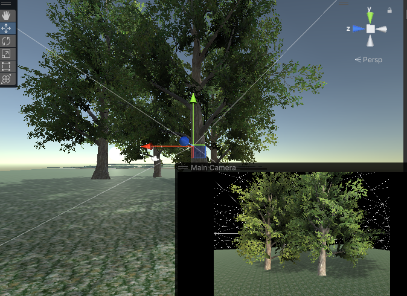

# Banana: The Game

Windows build avalible here: https://www.dropbox.com/scl/fi/2b3ofc4q1ax7yhepjuirv/Grace_BananaTheGame.zip?rlkey=frzy49z0lig8yqehcevf461ge&e=2&st=8vjejwmr&dl=0

Assets:
Banana Man: https://assetstore.unity.com/packages/3d/characters/humanoids/banana-man-196830
Bannana NPC: https://assetstore.unity.com/packages/3d/characters/party-fruits-party-game-characters-249814
Banana:  https://assetstore.unity.com/packages/3d/food-props-163295
Skybox: https://assetstore.unity.com/packages/2d/textures-materials/sky/fantasy-skybox-free-18353
Well: https://assetstore.unity.com/packages/3d/props/exterior/lowpoly-wells-68437
Unity standered assets used for terrain 

A04

https://github.com/user-attachments/assets/1775fb73-5508-4b0b-8381-5c92e90c397a

A05

See new files:
PlayerControls.cs
RigidFollowCamera.cs
SpringFollowCamera.cs

Character assets for Banna Man:
https://assetstore.unity.com/packages/3d/characters/humanoids/banana-man-196830

https://github.com/user-attachments/assets/320c2a1c-b2da-40f2-b9c6-3b55071d68fb

https://github.com/user-attachments/assets/daf0ce76-7a52-4f19-9fb2-1d50dfe95ca0

<video width="320" height="240" controls>
  <source src="RigidCamera.mp4" type="video/mp4">
</video>

<video width="320" height="240" controls>
  <source src="SpringCamera.mp4" type="video/mp4">
</video>

A07
New scripts:
PlayerMotionController.cs

https://github.com/user-attachments/assets/9d4bb65a-3c88-4b67-948d-c6e3e596f4f1

<video width="320" height="240" controls>
  <source src="motion.mp4" type="video/mp4">
</video>

A08
New Scripts:
Spawner.cs
CollectionGame.cs

banana assests: https://assetstore.unity.com/packages/3d/food-props-163295

https://github.com/user-attachments/assets/ad9633c8-d2e0-4529-ad0b-d22433aec318

A09
New scripts:
Wander.cs

Bannana NPC assets https://assetstore.unity.com/packages/3d/characters/party-fruits-party-game-characters-249814

https://github.com/user-attachments/assets/3c72de1b-3b27-4e0c-bf07-67259b4c657d

A10
New scripts:
BehaviorUnique.cs
BehaviorMinion.cs

https://github.com/user-attachments/assets/22dd1f09-092f-45e2-9ee7-848d84eb239a

